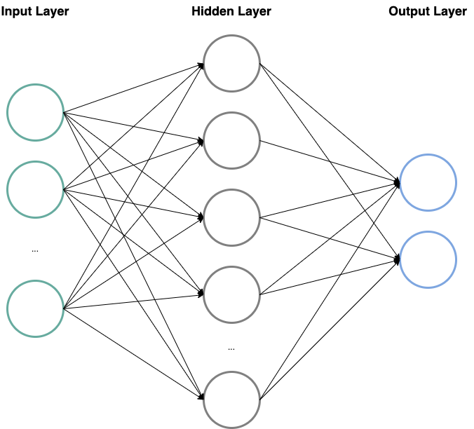

```{r setup, include=FALSE}
knitr::opts_chunk$set(echo = TRUE)
```

```{r todos_for_Adriana, include=FALSE, echo=FALSE}
### TODO for Adriana
  
# remove description text for sections (NN, Ridge Regression, Method, Data Set, Introduction) [Adriana]
# add more text to the results part (describing the graphs) compare values
# add more text to the discussion part
# write the conclusion

```

```{r todos_for_Vy, include=FALSE, echo=FALSE}
### TODO for Vy

# Explain NNs in general -> check
# more text to explain the findings of the NN. What does the numbers mean? -> check
```

```{r todos_for_Stefan, include=FALSE, echo=FALSE}
### TODO for Stefan

# add a small text to the standardization of the data [Stefan] -> check
# "conspicuousness" --> new name and maybe the graph after the image of the map [Stefan] -> check
# text for the boxplot of latitude and longitude [Stefan] -> check
#replace normal plots in ggplot -> check
#add + theme_bw() to each ggplot -> check
print("scatter plot für koordinaten und box plot für varianz in long und lat") # -> ceck
print("boxplot für distances für jedes modell -> um diese vergleichen zu können") # -> someone else did it already ... thx^^
```

```{r todos_for_matthias, include=TRUE, echo=FALSE}
### TODO for Matthias

# have a look at the weights of the ridge regression and make a simplified model with less variables [Matthias]
# test other model combinations for the NN to improve it. 
```


```{r import_libs, include=FALSE, echo=FALSE}
#install.packages("installr")
#library("installr")
#install.Rtools()

#install.packages("ggmap")
#install.packages("maptools")
#install.packages("maps")
#install.packages("glmnet")
#install.packages("ISLR")
#install.packages("rgl")
#install.packages("dplyr")
#install.packages("keras")
#install.packages("tensorflow")
#install.packages("ggplot2")
#install.packages("tensorflow")
#install.packages("Metrics")

library("glmnet")
library("ggplot2")
library("ggmap")
library("maptools")
library("maps")
library("dplyr")

library(ISLR)
options(rgl.printRglwidget = TRUE)
library(rgl)

library(Metrics)
library(keras)
library(tensorflow)
set_random_seed(1)

```

\newpage

# Introduction
Ethnomusicology is the study of music in its social and cultural contexts. Being a highly interdisciplinary field of research, we found it very interesting trying to apply some selected machine learning algorithms for comparison: Ridge Regression and Neural Networks (NNs) and compare its results to determine the geographical origin of tracks based on different features.  

# The Data Set
The data used in this project is provided by the authors of the paper "Predicting the Geographical Origin of Music"[@Zhou2015] who created and used this set as basis for this paper. The key information embedded in this data set are attributes of music pieces labeled by there point of origin.

The authors collected 1,142 pieces of music from a personal CD-collection. The target values represented by longitude and latitude are the main country/area of residence of the artists that produced the music. Over all the authors collected music from 73 countries/areas not including western style music, since this category is called to have a global influence and therefor unfitted for predicting a specific country/region. 

The attributes to describe the music pieces are automatically created by a software called MARSYAS [@tzanetakis2007marsyas], a software created to extract audio features from wave files. With MARSYAS the authors could convert every music peace to a set of 116 features called 'chromatic features'. The features are numerical and the authors claim to have normalized them into a gaussian normal distribution.

The selected task is suitable for classification and regression. However we decided that regression is a better approach because in first instance we don't have enough data to be representative to each country and secondly because of the special characteristics of desired output being coordinates.

```{r import_files, include=TRUE, echo=FALSE}
data <- read.csv("Data/default_plus_chromatic_features_1059_tracks.txt", header=FALSE)
data <- as.data.frame(data)
colnames(data)[117:118] <- c("Latitude", "Longitude")
```

```{r preprocessing, include=TRUE}
# Maybe some more preprocessing could be done here.
anyNA(data) # testing if there is at least a single NA -> but in this dataset there isn't
# Maybe some more pre-processing could be done here.
anyDuplicated(data) # testing for duplicates -> 0 found

```

## Insights into the Data

```{r check_if_standardized, include=TRUE, fig.align='center', out.width='.49\\linewidth', fig.show="hold", echo=FALSE, fig.cap="Distribution of Mean and Standard Deviation"}
# check if data is already standardized

# get columns without the target cols ("long" and "lat")
data_without_target_cols <- subset(data, select=-c(Latitude,Longitude))

# for each column in the data get sd and median
sd_per_col <- apply(data_without_target_cols, 2, sd) # the two stands for columns, if we would have used 1 it would calculate the sd of the rows
sd_per_col_df <- data.frame(sd_per_col)

mean_per_col <- apply(data_without_target_cols, 2, mean)
mean_per_col_df <- data.frame(mean_per_col)

sd_and_mean_per_col_df <- merge(sd_per_col_df, mean_per_col_df, by="row.names", all=TRUE)

#par(mar = c(4, 4, .1, .1)) # to make the two plots show side by side and not above each other

ggplot(sd_and_mean_per_col_df, aes(x=sd_per_col)) + 
  geom_boxplot(fill="slateblue", alpha=0.2) + 
  geom_vline(xintercept=1, linetype="dashed", color = "blue") +
  labs(title="standard deviation of the 116 columns",
        y ="standard deviation (blue line at 1)", x = "") +
  coord_flip() + theme_bw()

ggplot(sd_and_mean_per_col_df, aes(x=mean_per_col)) + 
  geom_boxplot(fill="slateblue", alpha=0.2) + 
  geom_vline(xintercept=0, linetype="dashed", color = "blue") +
  labs(title="mean of the 116 columns",
        y ="mean (blue line at 0)", x = "") +
  coord_flip() + theme_bw()
```

The paper[@Zhou2015] claims that the provided dataset is already standardized. To evaluate this statement, the mean and standard deviation for each feature column has been calculated and displayed in the boxplot above. This boxplot suggests that there is some kind of standardization, since all the features are roughly at a mean of 0 and a standard deviation of 1 (marked by the blue lines). But there are some outliers that have lower values. It seems like the standardization that the authors have been using was not super effective. Still we are not applying a second standardization on top of these standardization. This is mainly caused to be able to compare our findings with the one from the literature.

```{r insights_create_worldmap, include=TRUE, echo=FALSE, fig.cap="Different regions in the dataset"}
# basic world map with music origins
mapWorld <- borders("world", colour="gray50", fill="white")
mp <- ggplot() + mapWorld

mp + geom_point(data = data, aes(x = Longitude, y = Latitude), color = "red", alpha = 0.5) + theme_bw() + labs(x= "Longitude [°]", y= "Latitude [°]")
```

## Discrepancy Data and Paper
There seem to be discrepancies between the data set and the description of the data in the mentioned paper:
When looking at the map, it seems like there are way fewer unique data points than expected. The paper states that there are 1,142 pieces from 73 countries/areas, but counting the point on the map just returns 33 data points. The following code investigates this difference.

```{r insights_the_region_conspiracy, include=TRUE}
# investigate why there are fewer points on the map than regions on the map
# data is the full data set

# group data by unique combinations of long and lat and safe in data frame
# and count occurrences of each unique combination
# the unique combinations of long and lat represent regions
occurences_per_region <- data.frame(data %>% count(Longitude, Latitude, sort=TRUE))

nrow(occurences_per_region) # returns 33 -> 33 regions in the data set and not 71
                            # like proposed in the paper -> maybe not all data has been uploaded 

sum(occurences_per_region[, 'n']) # returns 1059 -> therefore there are 1095 tracks in the data set
```

The results suggest that there are actually only 33 unique combinations of latitude and longitude in the data set. Therefore the pieces can only be categorized into 33 different categories. The reason for this discrepancy to the suggested number in the paper (73) might be that some regions have been aggregated prior to uploading the data or some rows are missing. The second statement is also supported, by the fact that there are not 1,142 pieces in the data set as described in the paper, but only 1059 pieces. Whatever this (small) difference does not influence the tasked tackled/perused by this report.


```{r insights_3, include=TRUE, echo=FALSE, fig.cap="Distribution of longitude and latitude"}
df_lat <- data.frame(value = data$Latitude, dimension = "Latitude")
df_long <- data.frame(value = data$Longitude, dimension = "Longitude")
boxplot_df <- rbind(df_lat, df_long)

ggplot(boxplot_df, aes(x=value, y=dimension)) + 
  geom_boxplot(fill="slateblue", alpha=0.2) + 
  labs(title="Range of longitude and latitude observations",
        y ="Dimension", x = "Angle [°]") +
  coord_flip() + theme_bw()
```

To get a better overview of the data, the longitude and latitude of every observation have been plotted in a box plot. As expected from the map above, the median of both the latitude and longitude is at around 35 which would be the area around the middle east (more specific Turkey, Syria, Lebanon) which when looking at the map is more or less the center of all the regions. This is because most data points are Europe, South Asia and Africa, while only three regions are in America. Also as expected, the longitude observations have roughly twice the range of the longitude observations, which can be explained by the natural range of those measurements (Longitude ranges form -180 to 180 and latitude ranges from -90 to 90).

The one outlier in the latitude box at roughly -38, is the region of "Canberra" in Australia.

## Data Preparation

The data is divided into a training set (80%) and into a test set (20%). A separate validation set was not defined as cross-validation was used or the validation was done directly within the algorithm.

```{r split_into_test_and_train, include=TRUE}
set.seed(1)
n <-dim(data)[1]
train <- sample(1:n, 0.8*n)
test <- (1:n)[-train]
```

\newpage

# Analysis

## Method

We treat the problem of predicting the geographical origin of music as a regression problem since we want to predict the spherical coordinates (longitude and latitude). In Zhou et al. [@Zhou2015] they list two reasons as to why it's preferably not treated as a classification problem: One, the ratio between the large number of countries/areas and the number of examples per country/area is very disproportional and would result in poor classification results. And secondly, with regression we already have a natural error metric: The geographical distance from the true position.

```{r functions, include=TRUE}
distances <- function(predicted, actual_value) {
  dif <- predicted-actual_value
  dif <- dif * (40030/360) # scaling coordinates to km by the factor circumference (km) / 360°
  mse <- sqrt(dif[,1]^2 + dif[,2]^2)
  return(mse)
}
```
We wrote an overall function that calculates the distance between the predicted location of origin and the actual origin. The euclidean distance is used as a metrics. In fact, the algorithm is quite close to the calculation of the mean squared error for two dimensions. But it also converts the sphere coordinates into distances in [km]. This allows an easy interpretation of the results as well as a comparison with the results from the literature.

To analyze the data we first took a baseline using a linear regression model before we applied two algorithms: Ridge regression and neural networks.

## Baseline - Linear Regression

First, we take a baseline to get a basic understanding on how well our chosen algorithms perform. Therefore, we decided to use a linear regression. First we created a model which includes all variables. The lm() command cannot compute a model for both output variables at the same time. So it creates two separate linear models, one for each output variable:

```{r linear_regression_all_variables, include=TRUE}
model.lm.all <- lm(cbind(Longitude, Latitude)~., data=data[train,])
pred.all <- predict(model.lm.all, newdata=data[test,])
```

To calculate a good meaningful measurement for the goodness of fit for the predictions the distance from the true location is calculated. The distances are calculated as the euclidean distances of the Longitude and Latitude between the predictions and the true location. They are measured in [km]. These will be used for all the comparisons of the algorithms between each other but also with the baseline and also with the literature (Zhou et al. [@Zhou2015])

The predictions are on average quite far from the true destination:
```{r linear_regression_all_variables_result, include=TRUE, echo=FALSE}
distances_baseline <- distances(pred.all, data[test, c("Latitude","Longitude")])
mean(distances_baseline) ## final result in km
```

The impact of the variables was analysed. It seemed that not all of them have a significant influence on the models. So a second model was developed, just using the variable which have a significant influence on the full model, either on the Latitude or on the Longitude. 

```{r linear_regression_significant_variables, include=TRUE}
model.lm.sig <- lm(cbind(Longitude, Latitude)~ V4+V9+V16+V30+V32+V33+V37+V38+V61+V90+V91
                   +V92+V95+V96+V104+V5+V6+V8+V9+V11+V15+V34+V39+V63+V94+V97, 
                   data=data[train,])
pred.sig <- predict(model.lm.sig, newdata=data[test,])
```

The predictions for the smaller models are on average a bit better:
```{r linear_regression_significant_variables_result, include=TRUE, echo=FALSE}
mean(distances(pred.sig, data[test, c("Latitude","Longitude")])) ## final result in km
```

An ANOVA was calculated to check if there is a significant difference between the two models. 
```{r linear_regression_anova, include=TRUE, echo=FALSE}
anova(model.lm.all, model.lm.sig)
```

The model tells that there is a difference and, as seen before, the smaller model performs better.


```{r linear_regression_boxplot, echo=FALSE}
# TODO:  in GGPLOT2
small.model <- distances(pred.sig, data[test, c("Latitude","Longitude")])
full.model <- distances(pred.all, data[test, c("Latitude","Longitude")])
baseline.plot <- cbind.data.frame(small.model, full.model)

names(baseline.plot)[names(baseline.plot) == "small.model"] <- "Significant Variables"
names(baseline.plot)[names(baseline.plot) == "full.model"] <- "All Variables"

ggplot() + geom_boxplot(data=stack(baseline.plot), aes(y=values, x=ind), outlier.color="red", fill="blue", alpha=0.2) + theme_bw() + labs(x="Model", y = "Distances [km]")
```

\newpage

## Algorithm 1 - Ridge Regression

The first algorithm we tried was ridge regression. This algorithm is similar to a linear regression but as the linear regression tries to minimize the difference between the weighted input variables and the output data, the ridge regression adds a regularisation term to the input variables. 

$$RSS + \lambda \sum_{j=1} ^{p} { \hat{ \beta _j}  } ^2 = \sum_{i=1} ^n (y_i - \hat { \beta_0 } - \sum_{j=1} ^p { \hat  {\beta_j}x_ij})^2 + \lambda \sum_{j=1} ^{p} { \hat{ \beta }  } ^2_j$$

In fact, this is a possibility to fight over-fitting. If lambda is big the model tends to just take the b0 into account. So the predicted value is the mean of the output variable. If lambda is small, then the model tends to be a normal non-regularised model, hence the one from the linear regression. 

The command glmnet is used to perform the ridge regression. Cross-validation is performed to find the optimal lambda values. In general, it would be possible with glmnet to just calculate one single model for both output variables. But unfortunately, this option is not available when doing the cross-validation. So, again two independent cross-validations are done to get two values for lambda, one for each output variable.

```{r ridge_data_preparation, include=TRUE, echo=FALSE}
x <- model.matrix(cbind(Longitude, Latitude)~., data)[,1:116]
y <- data[, c("Latitude", "Longitude")]
```

```{r ridge_data_cv, include=TRUE, echo=FALSE}
ridge.mod.1 <- cv.glmnet(x[train,], y[train,1], alpha=0)

ridge.mod.1.plot <- cbind.data.frame(exp(ridge.mod.1$lambda), ridge.mod.1$cvm)
ggplot() + geom_point(data=ridge.mod.1.plot, aes(x=log10(ridge.mod.1$lambda), y=ridge.mod.1$cvm), color="red") + theme_bw() + labs(y="MSE", x = (expression(Log[10] (lambda)))) 

bestlam1 <- ridge.mod.1$lambda.min

ridge.mod.2 <- cv.glmnet(x[train,], y[train,2], alpha=0)

ridge.mod.2.plot <- cbind.data.frame(exp(ridge.mod.2$lambda), ridge.mod.2$cvm)
ggplot() + geom_point(data=ridge.mod.2.plot, aes(x=log10(ridge.mod.2$lambda), y=ridge.mod.2$cvm), color="red") + theme_bw() + labs(y="MSE", x = (expression(Log[10] (lambda)))) 

bestlam2 <- ridge.mod.2$lambda.min
```

It can be seen that the distributions for lambda are quite similar for both models. Although the MSE for both models differ the optimal lambda is quite similar:

```{r ridge_best_lambda, include=TRUE, echo=FALSE}
bestlam1
bestlam2
```

The model performs better with ridge regression as with the baseline. In this model two lambdas are used.

```{r ridge_data_two_lambdas, include=TRUE, echo=FALSE}
pred1 <- predict(ridge.mod.1, s=bestlam1, newx=x[test,])
pred2 <- predict(ridge.mod.2, s=bestlam2, newx=x[test,])

pred <- cbind(pred1, pred2)
mean(distances(pred, data[test, c("Latitude","Longitude")])) ## final result in km
```

There is also a multivariate ridge regression model calculated, hence a single model with two outputs for latitude and longitude. The lambda is found by cross-validation. Unfortunately, there is no built-in-function to perform the cross-validation in combination with glmnet as it was done with just one single output. So the cross-validation was written by hand. As it is not very optimized it takes over an hour to get a good value for lambda. So, that this process was done in a separate file. But the processed code is shown below:

```{r ridge_cv_code, include=TRUE, echo=TRUE, eval=FALSE}
# cross validation function similiar to the CV lesson in ML 1
cross.validation <- function(grid) {
  cv.err <- rep(NA, length(grid))
  tic("Cross-Validation")
  for (k in 1:length(grid)) {
    
    cv.loo <- rep(NA, n)
    
    for (i in 1:n) {
      # defining data as LOOCV
      loo.x <- x.train[-i,]
      loo.y <- y.train[-i,]
      # do multivariate regression model
      loo.fit <- glmnet(loo.x, loo.y, family = "mgaussian", alpha=0, lambda=grid[k])
      pred.y <- predict(loo.fit, s=grid[k], newx=t(as.matrix(x.train[i,])))
      cv.loo[i] <- distances(pred.y, y.train[i,])
    }
    cv.err[k] <- mean(cv.loo)
  }
  toc()
  return (cv.err)
}
```

With the so found best lambda the multivariate model was developed. The best lambda is:


```{r best_lambda, include=TRUE, echo=FALSE}
load("cv.RData")

bestlambda <- cv.fine[which(cv.fine[,2] == min(cv.fine[,2]))]
bestlambda
```

This results to this mean prediction error [km] for the test data:

```{r ridge_multivariate_model, include=TRUE, echo=FALSE}
ridge.mod.multivar <- glmnet(x[train,], y[train,], family = "mgaussian", alpha=0, lambda=bestlambda)
pred_ridge_regression <- predict(ridge.mod.multivar, s = bestlambda, newx=x[test,])
pred_ridge_regression <- pred_ridge_regression[,,1]
distances_ridge_regression <- distances(pred_ridge_regression, data[test, c("Latitude","Longitude")])
mean(distances_ridge_regression) ## final result in km
```


Also the grid search for the best lambda is shown below. Two searches were done. A rough one to find the interval to search in with a finer cross-validation:

```{r show_cv, include=TRUE, echo=FALSE, fig.cap="MSE"}
cv.rough <- as.data.frame(cv.rough)
ggplot() + geom_point(data = cv.rough, aes(x = log10(grid.rough), y = cv.err.rough), color = "blue") + theme_bw()  + labs(y = "MSE [km]", x = (expression(Log[10] (lambda))))
cv.fine <- as.data.frame(cv.fine)
ggplot() + geom_point(data = cv.fine, aes(x = log10(grid.fine), y = cv.err.fine), color = "red") + theme_bw() + labs(y = "MSE [km]", x = (expression(Log[10] (lambda))))
```

\newpage

## Algorithm 2 - Artificial Neural Networks (NNs)

For the second algorithm we'll be using Artificial Neural Networks (NNs) as they can be used for regression problems as well.
NNs are modeled loosely on the human brain and can consist of thousands or even millions of simple processing nodes that are densely interconnected. They are organized into layers of nodes, and they’re “feed-forward”: The data moves through them in only one direction [@nn_mit].

{width=50%}

NNs consist of node layers, containing an input layer, one or more hidden layers, and an output layer. Each node, or artificial neuron, connects to another and has an associated weight and threshold [@nn_ibm].
So each one is composed of input data, weights, a bias (or threshold) and an output.The equation for a NN is a linear combination of the independent variables and their respective weights and bias (or the intercept) term for each neuron:
$$ Z = \sum_{j=1} ^{n} { w_ix_i } + bias = w_1x_1 + w_2x_2 + ... + w_nx_n + w_0 $$
with $w_i$ being the weights or beta coefficients and $x_i$ being the independent variables or inputs and $w_0$ being the bias/intercept. The weights help determine the importance of any given variable: Larger ones will contribute significantly more to the output compared to other inputs. With this equation and the input we can then calculate our output.

To use NNs for our predictions we will, as with all machine learning models, fit the data to the model. This is done by minimizing the loss function, which for NN-regression is the mean of squared errors MSE over the training set. As we train the model, we’ll want to evaluate its accuracy using a cost (or loss or error) function.
$$ MSE = \frac{1}{n} \sum_{i=1}^{n}{(y - \hat{y_i})^2} $$
The goal is to minimize our cost function to ensure goodness of fit for any given observation. So in this case the MSE, which is calculated with the square of the difference between the actual and predicted value for each observation, is to be minimized. The model adjusts its weights and biases to reach the point of convergence, or the local minimum [@nn_ibm].

In the case of fitting a neural network, it is much faster if the data are scaled/normalised first and also gives more appropriate results if the features that are used have different scales and ranges. Since this is already the case with the data we have here, we won't have to do this anymore.

The advantages of NNs are that they are very powerful and enable the implementation of more complex matters. For our purposes, we can easily configure a multi-output neural network for our regression problem, so that two values for Latitude and Longitude are given at once.
Disadvantages could be that NNs are computationally more expensive and they might be unnecessarily complicated for more simple/not as complex tasks, depending on what one is trying to achieve. They could also be seen as some kind of blackbox, so there's also a trade-off between interpretability/explainability and the performance.

The NN used here takes all features from the training data and outputs two values for the Latitude and Longitude, so it is a multi-output regression. In-between Input and Output Layer are a few more Layers defined which all use ReLU as activation function. For compiling and fitting the model we again use the Mean Squared Error (MSE) as loss function and Adam as the optimizer. We let the model train for 100 epochs with a batch size of 128 and validation split of 0.2.
For the implementation we have used the keras and tensorflow libraries to define, compile and fit the model.

The results are visualized below.

```{r neural_network, include=TRUE, echo=FALSE}
set.seed(1)
X_train<-as.matrix(x[train,])
y_train<-as.matrix(y[train,])
X_test<-as.matrix(x[test,])
y_test<-as.matrix(y[test,])

# Initialize a sequential model
model <- keras_model_sequential() 

# Add layers to the model
model %>% 
    layer_dense(units=64, activation = "relu", input_shape = c(116)) %>% 
    #layer_dense(units=32, activation = "relu") %>% 
    layer_dense(units=16, activation = "relu") %>% 
    layer_dense(units=8, activation = "relu") %>% 
    #layer_dense(units=4, activation = "relu") %>% 
    layer_dense(units=2, activation="linear")

# Compile the model
model %>% compile(
     loss = 'mse',
     optimizer = 'adam',
     metrics = list("mean_squared_error", "mean_absolute_error")
 )

model %>% summary()

# Fit the model and store the fitting history in `history` 
history <- model %>% fit(
     X_train, 
     y_train, 
     epochs = 100,
     batch_size = 128, 
     validation_split = 0.2
 )
```

```{r neural_network_plots, include=TRUE, echo=FALSE, out.width="50%", fig.show="hold", fig.cap="Visualization Model Training"}
# Plot the history
#plot(history)

# Plot the MSE of the training data 
plot(history$metrics$mean_squared_error, main="Model's Mean Squared Error", xlab = "epoch", ylab="mse", col="#d42a44", type="l")

# Plot the MSE of the validation data
lines(history$metrics$val_mean_squared_error, col="#009999")

# Add Legend
legend("topright", c("training","validation"), col=c("#d42a44", "#009999"), lty=c(1,1))

# Plot the MAE of the training data 
plot(history$metrics$mean_absolute_error, main="Model's Mean Absolute Error", xlab = "epoch", ylab="mae", col="#d42a44", type="l")

# Plot the MAE of the validation data
lines(history$metrics$val_mean_absolute_error, col="#009999")

# Add Legend
legend("topright", c("training","validation"), col=c("#d42a44", "#009999"), lty=c(1,1))
```

For evaluation we predict the Longitude and Latitude for the same test data as for the other regression cases and use the MSE, the MAE as well as the custom distances metric we defined earlier. The MAE is calculated as follows:
$$ MAE = \frac{1}{n} \sum_{i=1}^{n}{|y - \hat{y_i}|} $$
We get the following results for the train and test data and the different evaluation metrics:

```{r neural_network_results, include=TRUE, echo=FALSE}
library(knitr)

### Train data ###

# MSE and MAE of train data
y_preds_train<-model %>% predict(X_train)
mse_train<-mean((y_train - y_preds_train)^2)
mae_train<-mae(y_train, y_preds_train)

# Customized distance metric
distances_mean_train<-mean(distances(y_train, y_preds_train)) 

### Test data ###

# Predict the Latitude for the test data
y_pred_neural_net <- model %>% predict(X_test)

# Evaluate with MSE and MAE
mse_test<-mean((y_test - y_pred_neural_net)^2)
mae_test<-mae(y_test, y_pred_neural_net)

# Evaluate on test data and labels with customized distance metric
distances_test_NN<-distances(y_test, y_pred_neural_net)
distances_mean_test<-mean(distances_test_NN)                   # 4122.794

df <- data.frame(Metric = c("MSE", "MAE", "Custom Distances Mean"),
                 "Train Data" = c(round(mse_train, 3), round(mae_train, 3), round(distances_mean_train, 3)),
                 "Test Data" = c(round(mse_test, 3),round(mae_test, 3), round(distances_mean_test, 3)), check.names = FALSE)

kable(df, caption = "Neural Network Results")
```

As we can see, the results on the training data are, as expected, better than for the test data. The MSE for both sets are quite different though, with the training data having an MSE of 644,28 and the test data having one around 67% higher. The values for the MAE have a discrepancy of approximately 26%.
The mean prediction error [km] calculated with the custom distances function for the training data is 3300,87 km, for the test data it's 4207,86 km.

# Results

```{r comparisons_of_distributions, include=TRUE, echo=FALSE, fig.cap="Distribution of discrepancy to correct location"}
distances_all <- cbind.data.frame(distances_baseline, distances_ridge_regression, distances_test_NN)
names(distances_all)[names(distances_all) == "distances_baseline"] <- "Baseline"
names(distances_all)[names(distances_all) == "distances_ridge_regression"] <- "Ridge Regression"
names(distances_all)[names(distances_all) == "distances_NN"] <- "NN"

ggplot() + theme_bw() + 
  geom_boxplot(data=stack(distances_all), aes(y=values, x=ind), fill = c("grey", "blue", "orange"), outlier.color="red") + labs (y = "Distances [km]", x ="Method")
```

In the boxplot above the distributions of the baseline and the two other algorithms are displayed next to each other. It is clearly to see that the baseline is worse than the two performed algorithms. Not just the median of the baseline is higher than the other two medians but especially the 75%-Quantile is much higher than the ones from the Ridge Regression and the NN. 

A comparisons of the two performed algorithms is a bit more difficult. The median is quite similar and as the box of the ridge regression is smaller the distribution is a bit more dense compared to the NN. But this algorithm doesn't seem to be better or worse compared to the NN.

Further investigations have to be done by displaying the predictions on a map and linking them to the true origins of the music:

```{r final_map_for_comparison, include=TRUE, echo=FALSE, fig.cap="Predicted results from different approaches"}
# y[test,]
target_values <- data.frame (Latitude = y[test,1],
                             Longitude = y[test,2])

target_values$index <- 1:nrow(target_values)
target_values$source <- "Original"

# y_pred_neural_net
neural_net_results <- data.frame (Latitude = y_pred_neural_net[,1],
                                  Longitude = y_pred_neural_net[,2])
neural_net_results$index <- 1:nrow(neural_net_results)
neural_net_results$source <- "NeuralNet"

# pred_ridge_regression
ridge_regression_results <- data.frame (Latitude = pred_ridge_regression[,1],
                                        Longitude = pred_ridge_regression[,2])
ridge_regression_results$index <- 1:nrow(ridge_regression_results)
ridge_regression_results$source <- "RidgeRegression"


#dim(target_values)
#dim(neural_net_results)
#dim(ridge_regression_results)

aggregated_results_ridge_regression <- rbind(target_values, ridge_regression_results)
aggregated_results_neural_net <- rbind(target_values, neural_net_results)


#nrow(aggregated_results_neural_net) # there are 1271 rows in each df

# because there are so many rows in each df we selct only 10% for the visualization
aggregated_results_ridge_regression_10_percent = aggregated_results_ridge_regression[aggregated_results_ridge_regression$index %% 10 == 0,]

aggregated_results_neural_net_10_percent = aggregated_results_neural_net[aggregated_results_neural_net$index %% 10 == 0,]

mapWorld <- borders("world", colour="gray50", fill="white")
mp <- ggplot() + mapWorld +
  geom_point(size = 1, data = aggregated_results_ridge_regression_10_percent, aes(Longitude, Latitude, group=index, color=source)) +
  geom_line(data = aggregated_results_ridge_regression_10_percent, aes(Longitude, Latitude, group=index, color="RidgeRegression")) +
  geom_point(size = 1, data = aggregated_results_neural_net_10_percent, aes(Longitude, Latitude, group=index, color=source)) +
  geom_line(data = aggregated_results_neural_net_10_percent, aes(Longitude, Latitude, group=index, color="NeuralNet"))
mp + theme_bw() + labs(x="Longitude [°]", y="Latitude [°]")
```

```{r investigations_on_angles, include=TRUE, fig.cap="Angles between different predicted coordinates"}

angle <- function(x,y){
  dot.prod <- x%*%y 
  norm.x <- norm(x,type="2")
  norm.y <- norm(y,type="2")
  theta <- acos(dot.prod / (norm.x * norm.y))
  alpha <- (as.numeric(theta))
  if (alpha > pi/2) {
    return(pi-alpha)
  } else {
    return(alpha)
  }
}

vectors.RR <- as.matrix(pred_ridge_regression - y[test,])
vectors.NN <- as.matrix(y_pred_neural_net - y[test,])
angles <- rep(NA, dim(vectors.RR)[1])
for (i in 1:dim(vectors.RR)[1]) {
  angles[i] <- angle(vectors.RR[i,], vectors.NN[i,])
}

ggplot() + theme_bw() + geom_boxplot(data=as.data.frame(angles), aes(x=angles), outlier.color = "red", fill="blue") + xlab("Angle")

```

\newpage

# Discussion
As we introduced, predicting data points on the earth using a latitude/longitude representation adds complexity to our problem because of the natural characteristics of coordinates. In first place longitude is discontinuous, meaning that the longitude of two points geographically near might be significantly different and secondly because coordinates are not linear. 

We decided on compare a traditional regression method against a more modern architecture like neural network assuming that the last one would perform better because the nature of selected data is not linear. For the first algorithm implementation, ridge regression had been used to fit two separate models in order to get the two desired output variables, this approach would assume that longitude and latitude are stochastically independent. For a better comparison, ridge regression had been fitted also as multivariate model. For both cases cross-validation had been used to determine de optimal lamdba. We would assume than given the relation between longitude and latitude second model would perform better, however by the results indicates that the assumptions is not valid, since MSE for tho implementations was very similar, 4492.287km and 4461.744 respectively. 

The second algorithm chosen was neural network, out hypothesis was that this one would lead better results to our problem than ridge regression  since its a parametric solution. Nevertheless, the 4 layer implementation achieved an error of 4287.664 km in the test data. While implementing it, we tried increasing hidden layers and number of neurons without important improvements. Which is better than ridge regression but not significantly. Even though we think that NN could be improved if we try other approaches like weight initialization. 

If we compare the two models applied by looking at MSE we know that NN performed better than ridge regression, as we assumed, however the difference is less than 200km. In comparison, the algorithms presented in [@Zhou2015] (KNN and RFR) performs significantly better than ours, achieving an average distance error from 3,100 km to 3,600 km. Another interesting thing to analyze is that, given the nature of the output variables of present analysis, the map showed in the 'Results' section give a visual overview of how big the errors of the models were. Talking about the sample illustrated in reference graph, we could notice that ridge regression is not doing good in predicting the items than belongs to America and that are less represented in our data set, this statement is also true for NN. Another feature to notice is that, also by the sample of the plot, both models are predicting some points in the ocean very far away from real observations.


# Conclusion
In summary, through this analysis we addressed the topic of predicting the geographical origin of some music tracks with to different regression algorithms. We were more familiar with ridge regression but wanted to try also NN. It would be ideal if we could have improved the paper results of having an error between 3,100 and 3,600 kilometers but unfortunately that was not achieved with implemented algorithms. We could conclude that for given data, paper applied models: KNN and Random Forest Regression performed better. Further research on how to tackle geo-spacial output variables could be done to either implement different models that end to be more efficient or trying to improve the NN more. Considering the size of the dataset adding more tracks to the analysis would for sure led to better results. Finally, would be also interesting to tackle the problem as classification and compare results with this analysis so we could determine the best solution for the general problem. 

\newpage

# References